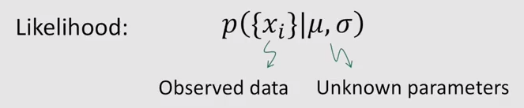
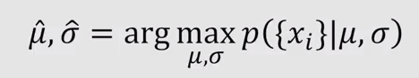
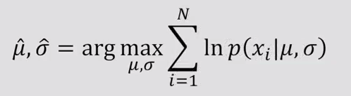
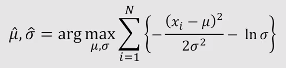
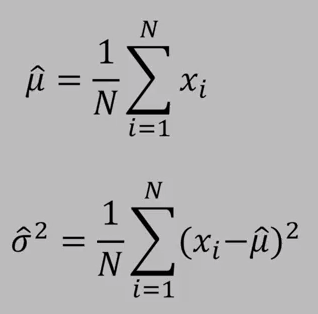

# Gaussian distribution

**What makes the Gaussian distribution useful and important?**

1. Only two parameters are needed to specify the Gaussian. They are called the **mean** and **variance**, and they capture the essense of the distribution. They are also easy to compute and interpret.
2. Mathematically the distribution has some nice properties. For example, product of Gaussian distributions forms another Gaussian. So you don't need to worry about encountering other forms of distributions when you perform operations on the Gaussian model.
3. More theoretically, the central limit theorem tells us that the expectation of the mean of any random variable converges to the Gaussian distribution.

*Gaussian is a proper choice for modeling noise and uncertainty.*

## 1D Gausian distribution
Gaussian distribution is expressed as an exponential term multiplied by a scalar.

We want to know the probability that **$x$**, the variable, lies within our Gaussian distribution. We call this probability density function. We use **$p(x)$** to write this. **$\mu$** is the mean of our Gaussian and **$\sigma$** is its standard deviation. We call **$\sigma^2$** variance.

\[
p(x) = \frac{1}{\sqrt{2\pi\sigma}}\exp\Big\{-\frac{(x-\mu)^2}{\sqrt{2\sigma^2}}\Big\}
\]

- **$x$** variable
- **$\mu$** mean
- **$\sigma^2$** variance
- **$\sigma$** standard deviation
- **$p(x)$** probability that the variable **$x$**, lies within our Gaussian distribution

### Gaussian distribution with different **$\mu$** mean and **$\sigma^2$** variance

![We'll first consider when a distribution has zero mean and univariance. This is a often called the **standard normal distribution**. If you'll look at the graph and look inside the exponential parts of the expression, you will see this distribution is symmetric about the mean, which is 0 in this case. Also you should notice that the value of **$p(x)$** gets very small as **$x$** goes far from the mean. This is due to the minus sign inside the exponential function. The last thing to notice is the scalar term outside the exponential function. Remember Gaussian is a probability distribution and thus its integral, the integral of p(x), must be 1. Now let's consider other cases with different values for the mean.](images/gaussian_distribution_01.png)

## Maximum Likelihood Estimate (MLE)
We are going to learn how we can compute an estimate of the Gaussian model parameters from observed data.
Gaussian model has two parameters, mean and variance. We are going to use the term likelihood often throughout the course. Let's talk about its definition.

The subscript **$i$** indicates one particular observation **$x_{i}$** among multiple observations of **$x$**. The important thing I want to point is that we have the data, what is to be determined are the parameters. In our case, we are using a Gaussian model. Thus, the parameters are **$\mu$** and **$\sigma$**.

**We are interested in obtaining the parameters of our model that maximizes the likelihood of a given set of observations.**

